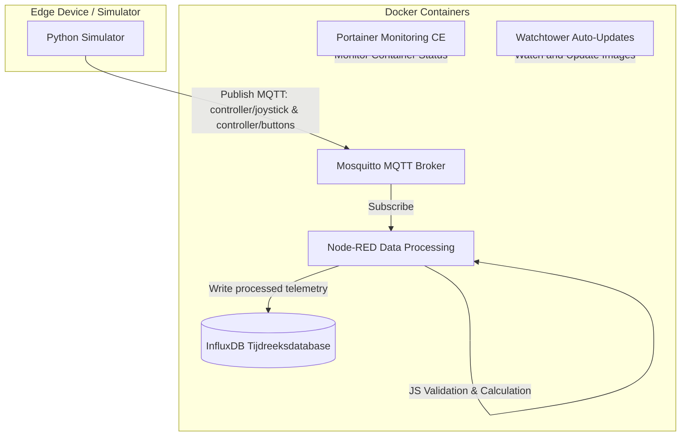

# Smart Sensor Gateway met Monitoring en Automatisatie
**Vak**: Cloud Computing  
**Academiejaar**: 2025-2026  
**Auteur**: Leroy M. (Individueel Project)  

---

## 1. Situering & Architectuur

Dit project implementeert een containergebaseerde edge-gatewayarchitectuur voor het verzamelen, verwerken, opslaan en visualiseren van sensordata. Het systeem verzamelt data van een gesimuleerde controller (joystick- en knopwaarden) via het MQTT-protocol, verwerkt deze in real-time met Node-RED, slaat de gevalideerde data op in een InfluxDB tijdreeksdatabase, en maakt monitoring mogelijk via Portainer.

### Architectuurdiagram (Data Flow)



---

## 2. Componenten en Functionaliteit

### 2.1 Sensorcommunicatie (MQTT Broker)
*   **Service**: Eclipse Mosquitto (`mosquitto`)
*   **Poort**: `1883`
*   **Topics**:
    *   `controller/joystick`: Publiceert real-time X/Y coördinaten (JSON: `{"x": <int>, "y": <int>}`).
    *   `controller/buttons`: Publiceert de status van knoppen A en B (JSON: `{"button_a": <bool>, "button_b": <bool>}`).

### 2.2 Dataverwerking & Logica (Node-RED)
*   **Service**: Node-RED (`nodered`)
*   **Poort**: `1880`
*   **Datalogica (Function Nodes)**:
    1.  **Joystick validatie & herberekening**: 
        *   **Validatie**: Controleert of coördinaten getallen zijn en binnen het bereik `[-100, 100]` liggen. Indien buiten bereik (anomalie), wordt een waarschuwing gelogd en de meting gefilterd (niet doorgestuurd).
        *   **Herberekening**: Normaliseert de X en Y waarden naar het bereik `[-1.0, 1.0]` en berekent de Euclidische afstand vanaf het middelpunt: $d = \sqrt{x_{norm}^2 + y_{norm}^2}$.
    2.  **Buttons validatie & mapping**:
        *   **Validatie**: Controleert of de knoptoestanden correcte booleans zijn.
        *   **Mapping**: Converteert booleans (`true`/`false`) naar binaire getallen (`1`/`0`) voor betere opslag en visualisatie in InfluxDB dashboards.

### 2.3 Opslag (InfluxDB)
*   **Service**: InfluxDB v2 (`influxdb`)
*   **Poort**: `8086`
*   **Automatische Setup**: De database wordt automatisch geïnitialiseerd bij de eerste start met een voorgedefinieerde bucket (`sensor_data`), organisatie (`sensor_gateway`), en een beveiligd admin-token.

### 2.4 Sensor Simulator (Python)
*   **Service**: Python Simulator (`simulator`)
*   **Functie**: Genereert elke 2 seconden willekeurige joystick- en knopwaarden. Er is een ingebouwde kans van 5% op een coördinaten-anomalie (waarden zoals `150` of `-120`) om aan te tonen dat Node-RED onjuiste metingen succesvol detecteert en filtert.

### 2.5 Monitoring & Beheer
*   **Portainer CE (`portainer`)**: Draait op poort `9000` en geeft een grafische weergave van de status, logs en bronnenverbruik van de Docker-containers.
*   **Watchtower (`watchtower`)**: Controleert elke 30 seconden op updates van de gebruikte base-images en herstart de containers automatisch bij een update (Continuous Deployment bonus).

---

## 3. Netwerk & Poort Mapping

Alle services draaien binnen een geïsoleerd Docker-netwerk (`gateway_net`). De volgende poorten zijn beschikbaar op de host-machine:

| Service | Container Poort | Host Poort | Beschrijving |
| :--- | :---: | :---: | :--- |
| **Mosquitto** | `1883` | `1883` | MQTT Broker listener |
| **Node-RED** | `1880` | `1880` | Flows Editor & UI |
| **InfluxDB** | `8086` | `8086` | InfluxDB API & Dashboard |
| **Portainer** | `9000` | `9000` | Container management UI |

---

## 4. Installatie & Uitrol (Automatisatie)

### Vereisten
*   Docker & Docker Compose (v2) geïnstalleerd op het systeem.
*   *Optioneel*: Git voor versiebeheer.

### Snelle Start (Linux & macOS)
Maak de scripts uitvoerbaar en start het uitrolscript:
```bash
chmod +x deploy.sh backup.sh
./deploy.sh
```

### Snelle Start (Windows)
Open PowerShell als Administrator in de projectmap en voer het volgende script uit:
```powershell
Set-ExecutionPolicy Bypass -Scope Process
.\deploy.ps1
```

Het script voert automatisch de volgende stappen uit:
1.  Haalt de nieuwste base-images op.
2.  Bouwt de Node-RED image met de vereiste InfluxDB-bibliotheek.
3.  Bouwt de Python simulator image.
4.  Herstart de volledige stack met de nieuwste configuraties via Docker Compose.
5.  **Dashboard-inrichting**: Richt automatisch het dashboard in InfluxDB in via de API (maakt een dashboard genaamd "Smart Sensor Gateway Dashboard" met 4 vooraf geconfigureerde widgets).

---

## 5. InfluxDB Visualisatie & Flux Queries

Na het opstarten van de stack kun je via `http://localhost:8086` inloggen met de volgende credentials:
*   **Gebruikersnaam**: `admin`
*   **Wachtwoord**: `adminpassword123`
*   **Organisatie**: `sensor_gateway`
*   **Bucket**: `sensor_data`

Maak in de InfluxDB UI een nieuw Dashboard aan en voeg widgets toe met de volgende Flux-queries:

### 5.1 Live weergave van de joystick- en knopwaarden
Deze query toont de joystick-waarden over het geselecteerde tijdsbereik van het dashboard, uitgemiddeld per 10 seconden voor een rustiger beeld:
```flux
from(bucket: "sensor_data")
  |> range(start: v.timeRangeStart, stop: v.timeRangeStop)
  |> filter(fn: (r) => r["_measurement"] == "joystick")
  |> filter(fn: (r) => r["_field"] == "x" or r["_field"] == "y")
  |> aggregateWindow(every: 10s, fn: mean, createEmpty: false)
```

En voor de knoppen (geeft `1` of `0` weer, gedownsampled per 10 seconden):
```flux
from(bucket: "sensor_data")
  |> range(start: v.timeRangeStart, stop: v.timeRangeStop)
  |> filter(fn: (r) => r["_measurement"] == "buttons")
  |> aggregateWindow(every: 10s, fn: last, createEmpty: false)
```

### 5.2 Gemiddelde joystick-afstand over 1 uur
Berekent de gemiddelde afstand (deviation van de center) van de joystick in het afgelopen uur:
```flux
from(bucket: "sensor_data")
  |> range(start: -1h)
  |> filter(fn: (r) => r["_measurement"] == "joystick")
  |> filter(fn: (r) => r["_field"] == "distance")
  |> mean()
```

### 5.3 Gemiddelde joystick-afstand over 24 uur
Berekent de gemiddelde afstand van de joystick in de afgelopen 24 uur:
```flux
from(bucket: "sensor_data")
  |> range(start: -24h)
  |> filter(fn: (r) => r["_measurement"] == "joystick")
  |> filter(fn: (r) => r["_field"] == "distance")
  |> mean()
```

---

## 6. Backups Maken (Bonus)

Om de integriteit van de sensordata en de Node-RED configuratie te waarborgen, is er een automatisch back-upscript meegeleverd.

### Back-up uitvoeren (Linux):
```bash
./backup.sh
```

### Back-up uitvoeren (Windows):
```powershell
.\backup.ps1
```

Dit script maakt een map aan onder `backups/backup_[timestamp]` met daarin:
1.  `nodered_flows.json`: De actuele flowconfiguratie van Node-RED.
2.  `influx_db/`: Een volledige binaire back-up van de InfluxDB bucket, klaar om hersteld te worden.

---

## 7. Reflectie & Samenwerking (Individueel)

Omdat ik deze opdracht **individueel** heb uitgevoerd, ben ik zelf verantwoordelijk voor alle onderdelen van de gateway-stack:
*   **Infrastructuur**: Docker-compose configuratie, geïsoleerd netwerk, Portainer en Watchtower integratie.
*   **Sensor Broker & Simulator**: Opzetten van Mosquitto en het programmeren van de Python telemetry simulator (inclusief anomaly generatie).
*   **Dataverwerking**: Het ontwerpen van de Node-RED flow, implementeren van JavaScript logica in de function nodes en koppeling met de database.
*   **Database & CI/CD**: InfluxDB containerinitialisatie en de automatisatiescripts (`deploy` / `backup`).
